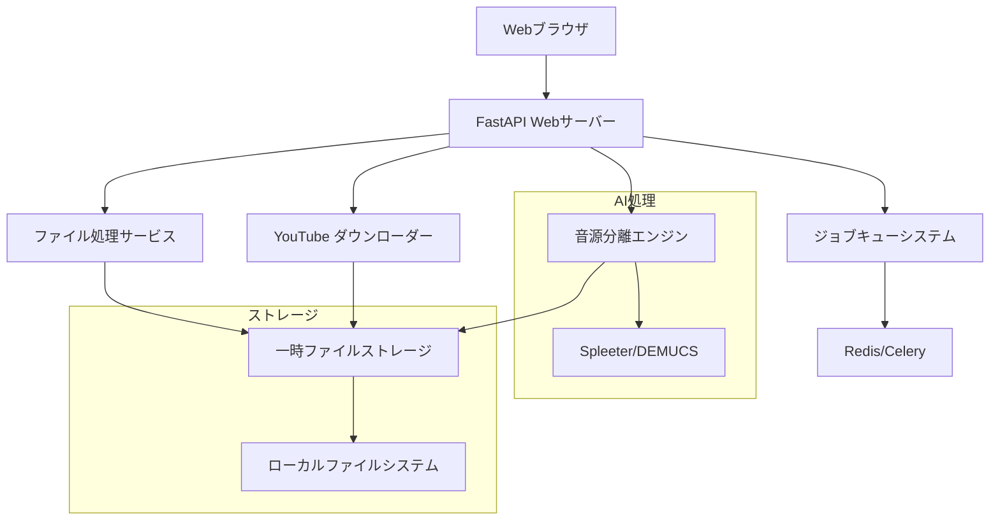

# 設計書: ボーカル抽出システム

## 概要

YouTubeや音楽ファイルからボーカル音声を抽出するWebアプリケーション。Python FastAPIをバックエンドとし、HTML/CSS/JavaScriptでフロントエンドを構築する。AI音源分離技術を使用してボーカルトラックを分離し、ユーザーが簡単にダウンロードできる仕組みを提供する。

## アーキテクチャ

### システム構成



### 技術スタック

- **バックエンド**: Python 3.9+, FastAPI, Uvicorn
- **フロントエンド**: HTML5, CSS3, Vanilla JavaScript
- **音源分離**: Spleeter または DEMUCS
- **YouTube処理**: yt-dlp
- **音声処理**: librosa, pydub
- **ジョブキュー**: Celery + Redis
- **ファイル処理**: aiofiles
- **バリデーション**: Pydantic

## コンポーネントと インターフェース

### 1. Webインターフェース層

#### HTMLテンプレート
- `index.html`: メインページ（ファイルアップロード、URL入力）
- `result.html`: 処理結果表示ページ
- `error.html`: エラー表示ページ

#### CSSスタイル
- レスポンシブデザイン
- プログレスバー、ローディングアニメーション
- モバイルフレンドリーなUI

#### JavaScript機能
- ファイルドラッグ&ドロップ
- リアルタイム進捗表示
- オーディオプレーヤー制御
- AJAX通信

### 2. FastAPI アプリケーション

#### エンドポイント設計

```python
# メインページ
GET /                           # HTMLページ提供
GET /static/{file_path}         # 静的ファイル提供

# ファイル処理
POST /upload                    # 音声ファイルアップロード
POST /youtube                   # YouTube URL処理

# 処理状況
GET /status/{job_id}            # ジョブ状況確認
GET /progress/{job_id}          # 進捗取得

# 結果取得
GET /preview/{job_id}           # プレビュー音声取得
GET /download/{job_id}          # 完成ファイルダウンロード

# システム
GET /health                     # ヘルスチェック
```

### 3. ファイル処理サービス

#### FileProcessor クラス
```python
class FileProcessor:
    def validate_file(self, file: UploadFile) -> bool
    def get_audio_duration(self, file_path: str) -> float
    def convert_to_wav(self, input_path: str) -> str
    def cleanup_files(self, file_paths: List[str]) -> None
```

### 4. YouTube ダウンローダー

#### YouTubeDownloader クラス
```python
class YouTubeDownloader:
    def validate_url(self, url: str) -> bool
    def get_video_info(self, url: str) -> dict
    def download_audio(self, url: str, output_path: str) -> str
    def check_duration_limit(self, url: str) -> bool
```

### 5. 音源分離エンジン

#### VocalSeparator クラス
```python
class VocalSeparator:
    def __init__(self, model_name: str = "spleeter:2stems-16kHz")
    def separate_vocals(self, input_path: str, output_dir: str) -> str
    def get_separation_progress(self, job_id: str) -> float
    def validate_output_quality(self, input_path: str, output_path: str) -> bool
```

### 6. ジョブキューシステム

#### JobManager クラス
```python
class JobManager:
    def create_job(self, job_type: str, params: dict) -> str
    def get_job_status(self, job_id: str) -> JobStatus
    def update_progress(self, job_id: str, progress: float) -> None
    def complete_job(self, job_id: str, result_path: str) -> None
    def fail_job(self, job_id: str, error_message: str) -> None
```

## データモデル

### ジョブステータス
```python
class JobStatus(Enum):
    PENDING = "pending"
    PROCESSING = "processing"
    COMPLETED = "completed"
    FAILED = "failed"

class ProcessingJob(BaseModel):
    job_id: str
    job_type: str  # "file_upload" or "youtube_download"
    status: JobStatus
    progress: float = 0.0
    created_at: datetime
    completed_at: Optional[datetime] = None
    input_file: str
    output_file: Optional[str] = None
    error_message: Optional[str] = None
    estimated_duration: Optional[float] = None
```

### ファイル情報
```python
class AudioFileInfo(BaseModel):
    filename: str
    file_size: int
    duration: float
    format: str
    sample_rate: int
    channels: int

class ProcessingResult(BaseModel):
    job_id: str
    original_file: AudioFileInfo
    vocal_file: AudioFileInfo
    processing_time: float
    download_url: str
    preview_url: str
    expires_at: datetime
```

## 正確性プロパティ

*プロパティとは、システムのすべての有効な実行において真であるべき特性や動作のことです。これらは人間が読める仕様と機械で検証可能な正確性保証の橋渡しとなります。*

### プロパティ 1: ファイル形式検証
*すべての* アップロードファイルに対して、サポートされている形式（MP3、WAV、M4A、FLAC）は受け入れられ、サポートされていない形式は拒否される
**検証対象: 要件 1.1, 1.3**

### プロパティ 2: 時間制限検証
*すべての* 音声ファイルとYouTube動画に対して、10分以下のものは処理され、10分を超えるものは拒否される
**検証対象: 要件 1.2, 2.2**

### プロパティ 3: URL検証
*すべての* 入力URLに対して、有効なYouTube URLは処理され、無効なURLは適切なエラーメッセージと共に拒否される
**検証対象: 要件 2.3**

### プロパティ 4: 音源分離処理
*すべての* 有効な音声入力に対して、音源分離処理が完了すると、ボーカルのみの音声ファイルが生成される
**検証対象: 要件 3.2**

### プロパティ 5: ファイル出力形式
*すべての* 処理完了ジョブに対して、ダウンロード可能なファイルはWAV形式で提供され、適切なタイムスタンプ付きファイル名を持つ
**検証対象: 要件 4.2, 4.3**

### プロパティ 6: 進捗表示
*すべての* 処理中ジョブに対して、0から100の間の進捗値が提供され、処理完了時には100になる
**検証対象: 要件 1.4, 2.5, 3.4**

### プロパティ 7: エラーハンドリング
*すべての* 処理失敗ケースに対して、明確なエラーメッセージが提供され、ユーザーフレンドリーな形式で表示される
**検証対象: 要件 3.3, 5.4**

### プロパティ 8: プレビュー制限
*すべての* プレビュー音声に対して、再生時間は30秒以下に制限される
**検証対象: 要件 6.4**

### プロパティ 9: ファイルクリーンアップ
*すべての* 一時ファイルに対して、24時間後に自動的に削除される
**検証対象: 要件 4.4**

### プロパティ 10: 同時処理制限
*すべての* 処理リクエストに対して、システムは設定された同時処理数を超えない
**検証対象: 要件 7.4**

### プロパティ 11: 入力サニタイゼーション
*すべての* ユーザー入力に対して、適切な検証とサニタイゼーションが実行される
**検証対象: 要件 8.1, 8.2, 8.3**

### プロパティ 12: ログ記録
*すべての* 処理活動に対して、適切なログエントリが記録される
**検証対象: 要件 8.4**

## エラーハンドリング

### エラー分類と対応

1. **入力検証エラー**
   - 不正なファイル形式
   - ファイルサイズ/時間超過
   - 無効なURL

2. **処理エラー**
   - 音源分離失敗
   - ファイル変換エラー
   - YouTube ダウンロード失敗

3. **システムエラー**
   - リソース不足
   - ネットワークエラー
   - ストレージエラー

### エラーレスポンス形式
```python
class ErrorResponse(BaseModel):
    error_code: str
    message: str
    details: Optional[str] = None
    suggested_action: Optional[str] = None
    timestamp: datetime
```

## テスト戦略

### 単体テスト
- 各コンポーネントの個別機能テスト
- エラーケースとエッジケースの検証
- モックを使用した外部依存関係の分離

### プロパティベーステスト
- 上記の正確性プロパティを検証
- ランダムな入力に対する普遍的な動作確認
- 最低100回の反復実行で各プロパティをテスト
- テストタグ形式: **Feature: vocal-extractor, Property {番号}: {プロパティテキスト}**

### 統合テスト
- エンドツーエンドのワークフローテスト
- 実際のファイルとYouTube URLを使用
- パフォーマンステスト

### テストライブラリ
- **単体テスト**: pytest
- **プロパティベーステスト**: Hypothesis
- **APIテスト**: httpx + pytest-asyncio
- **ファイル処理テスト**: tempfile + pytest fixtures

### プロパティ反映

事前作業分析を確認した結果、以下の冗長性を特定しました：

- プロパティ1（ファイル形式受け入れ）とプロパティ3（無効形式拒否）は、入力検証の包括的なプロパティに統合可能
- プロパティ4、8、12、16（各種進捗表示）は、進捗表示の汎用プロパティに統合可能
- プロパティ5（YouTube URL処理）とプロパティ6（無効URL拒否）は、URL処理の包括的なプロパティに統合可能

### 正確性プロパティ

**プロパティ 1: ファイル入力検証**
*任意の* アップロードファイルに対して、サポートされた形式（MP3、WAV、M4A、FLAC）かつ200MB以下の場合は受け入れ、そうでなければ適切なエラーメッセージを返す
**検証対象: 要件 1.1, 1.2, 1.3**

**プロパティ 2: 進捗表示の一貫性**
*任意の* 長時間処理（アップロード、ダウンロード、音源分離）において、処理開始から完了まで進捗情報が継続的に更新される
**検証対象: 要件 1.4, 2.4, 3.4**

**プロパティ 3: YouTube URL処理**
*任意の* URL入力に対して、有効なYouTube URLの場合は音声ダウンロードを実行し、無効または利用不可の場合は適切なエラーメッセージを返す
**検証対象: 要件 2.1, 2.2, 2.3**

**プロパティ 4: ボーカル抽出処理**
*任意の* 有効な音声ファイルに対して、音源分離処理を実行し、ボーカルのみの音声ファイルを生成する
**検証対象: 要件 3.1, 3.2**

**プロパティ 5: エラーハンドリングの一貫性**
*任意の* 処理失敗において、明確なエラーメッセージと推奨解決策を提供する
**検証対象: 要件 3.3, 5.4**

**プロパティ 6: 音質保持**
*任意の* 音声ファイルに対して、ボーカル抽出処理後も元の音質レベルを維持する
**検証対象: 要件 3.5**

**プロパティ 7: ダウンロード機能**
*任意の* 処理完了したボーカルファイルに対して、WAVフォーマットでダウンロードリンクを提供し、タイムスタンプ付きファイル名を生成する
**検証対象: 要件 4.1, 4.2, 4.3**

**プロパティ 8: ファイルクリーンアップ**
*任意の* 一時ファイルに対して、24時間後に自動削除される
**検証対象: 要件 4.4**

**プロパティ 9: UI要素の提供**
*任意の* 操作段階において、適切なUI要素（指示、ローディング、プレーヤー）が提供される
**検証対象: 要件 5.2, 5.3, 6.1**

**プロパティ 10: レスポンシブデザイン**
*任意の* デバイス（デスクトップ、モバイル）において、適切にレイアウトが調整される
**検証対象: 要件 5.5**

**プロパティ 11: プレーヤー機能**
*任意の* 抽出されたボーカルファイルに対して、基本コントロール付きプレーヤーで30秒制限のプレビューを提供する
**検証対象: 要件 6.2, 6.3, 6.4**

**プロパティ 12: 同時処理管理**
*任意の* 複数リクエストに対して、適切なキューイングと負荷制限を実行し、待機時間を表示する
**検証対象: 要件 7.1, 7.2, 7.3, 7.4**

**プロパティ 13: 入力検証とセキュリティ**
*任意の* ユーザー入力に対して、適切な検証、サニタイゼーション、セキュリティ対策を実行する
**検証対象: 要件 8.1, 8.2, 8.3**

**プロパティ 14: ログ記録**
*任意の* システム処理に対して、監視とデバッグ用のログを記録する
**検証対象: 要件 8.4**

## エラーハンドリング

### エラー分類

1. **入力エラー**
   - 無効なファイル形式
   - ファイルサイズ超過
   - 無効なYouTube URL

2. **処理エラー**
   - 音源分離失敗
   - ファイル変換エラー
   - ネットワークエラー

3. **システムエラー**
   - サーバー過負荷
   - ディスク容量不足
   - 外部サービス障害

### エラー応答形式

```python
class ErrorResponse:
    error_code: str
    message: str
    details: Optional[str]
    suggested_actions: List[str]
    timestamp: datetime
```

## テスト戦略

### 二重テストアプローチ

**ユニットテスト**: 特定の例、エッジケース、エラー条件を検証
**プロパティテスト**: すべての入力にわたる汎用プロパティを検証

### プロパティベーステスト設定

- **テストライブラリ**: Hypothesis (Python)
- **最小実行回数**: 各プロパティテストあたり100回
- **タグ形式**: **Feature: vocal-extractor, Property {number}: {property_text}**

### テスト範囲

1. **ファイル処理テスト**
   - 各種音声形式の処理
   - ファイルサイズ制限
   - 破損ファイルの処理

2. **YouTube処理テスト**
   - 有効/無効URL処理
   - 制限された動画の処理
   - ネットワークエラー処理

3. **音源分離テスト**
   - 各種音楽ジャンルでの分離品質
   - 処理時間の測定
   - メモリ使用量の監視

4. **UI/UXテスト**
   - レスポンシブデザイン
   - 進捗表示の正確性
   - エラーメッセージの表示

5. **セキュリティテスト**
   - 悪意のあるファイルアップロード
   - SQLインジェクション対策
   - XSS対策

### パフォーマンス要件

- ファイルアップロード: 10MB/秒以上
- 音源分離処理: 5分以内（平均的な楽曲）
- 同時処理: 最大10ジョブ
- レスポンス時間: API呼び出し500ms以内